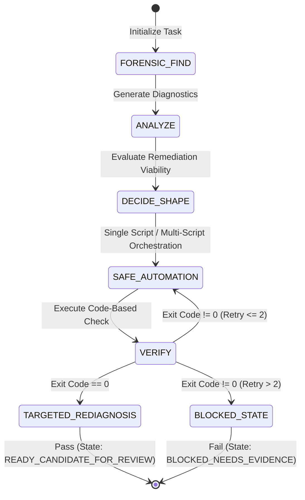

# Automated Execution & Governance Policy

## 1. System Objective & Architecture
The Automated Execution Policy (AEP) defines a strict, programmatic runtime contract for modifying code and configs in the monorepo. Automation and scripting are not aesthetic options; they are system-level invariants designed to guarantee:
* **Deterministic Execution**: Zero reliance on human memory, ad-hoc edits, or manual file-by-file operations.
* **Hermetic & Repeatable State**: Diagnostic and verification runs must produce identical outcomes under identical repository states.
* **Token Budget Optimization**: Programmatic filters and exclusions to minimize LLM token drain during repository scans.
* **Verifiable Closure**: Cryptographically or programmatically verifiable proof of system correctness (e.g., exit codes, JSON outputs) prior to state transitions.



---

## 2. Core Execution Invariants
All repository modifications must comply with the following runtime contract:
1. **No Dry Execution**: Modifying the repository state without executing a corresponding diagnostic and validation suite is a contract violation.
2. **Exclusion of Scattered Manual Edits**: Mass modifications via manual file-by-file searching are prohibited. If a change pattern spans $>1$ file, it must be resolved programmatically.
3. **Sufficient Automation Sizing**:
   $$\text{Execution Scope} \propto \text{Task Risk Profile}$$
   Creating a new script is not required if existing workspace tools (e.g., `pnpm run guard:*`, `nx run`, `git show/diff`) can verify the correctness of the change.
4. **Post-Manual Validation**: If an exceptional manual hotfix is applied, a target validation script must execute immediately as a post-condition to confirm state validity.

---

## LeanCTX Integration Rule
When LeanCTX is active, the agent must prioritize `ctx_*` tools over their native equivalents.
* **Tool Preference**:
  * Read/cat → `ctx_read`
  * Glob/find → `ctx_glob`
  * Grep/search → `ctx_search`
  * Shell/bash → `ctx_shell`
  * Directory tree/listing → `ctx_tree`
  * Multi-step context gathering → `ctx_compose`
  * Symbol lookup → `ctx_symbol`
  * Semantic lookup → `ctx_semantic_search`
  * Call graph investigation → `ctx_callgraph`
* **Invariants**:
  * Do not use native Read, Grep, Shell, or Glob commands when `ctx_*` equivalents are available, working, and sufficient for the action.
  * If LeanCTX is unavailable or insufficient for a specific action, the agent must fall back to the smallest safe native equivalent and document the reason in the prompt response.
  * LeanCTX is the default layer for context gathering, diagnostics, and understanding, while automation scripts and guards are for execution and verification when necessary.

---

## Smart Automation Selection Rule
Automation is mandatory as an execution method, but creating a new script is conditional. The agent must choose the smallest sufficient automated path to maximize safety and token efficiency.

### Decision Rule & Levels
Before executing modifications, the agent must evaluate the task and choose the appropriate level:

#### A. No New Script Required
* **Criteria**: Tiny edits (typos, isolated documentation fixes, single-line modifications).
* **Requirements**:
  * Use LeanCTX or targeted reads to understand scope.
  * Execute a targeted diff review.
  * Run `git diff --check` or a lightweight validation after the modification.
  * Do not run broad workspace scans.
  * Do not create any new scripts.

#### B. Existing Command or Guard
* **Criteria**: A suitable guard (`pnpm run guard:*`), package script, unit test, linter, Nx command, or Graphify command already exists.
* **Requirements**:
  * Reuse the existing commands/guards first to prevent tool duplication.
  * Select the smallest sufficient command/filter (avoid full-workspace checks unless strictly justified).

#### C. Small Targeted Script
* **Criteria**: Repeated pattern with narrow scope.
* **Requirements**:
  * Create a short, scoped, idempotent script.
  * Support `--dry-run` or dry-run validation if writing.
  * Output must be concise status summaries.
  * Do not scan unrelated files.

#### D. Single Structured Script
* **Criteria**: Single domain task with a linear flow: check → apply → verify.
* **Requirements**:
  * Clear input/output boundaries.
  * Strict allowlist/filter of files.
  * Fail-closed behavior.
  * Summarized telemetry logs.

#### E. Multiple Small Scripts
* **Criteria**: Complex, multi-layered, or high-risk tasks requiring separation of concerns.
* **Requirements**:
  * Separate scripts: `diagnose` under `tools/diagnostics`, `apply` (remediation) under `tools/scripts`, and `verify` under `tools/scripts` or `tools/diagnostics`.
  * Lightweight validation gates only when useful.
  * Each script must have one clear, single responsibility.
  * Support full Close Loops.

### Core Principle
$$\text{Best Option} = \text{Smallest Sufficient Automation}$$
* LeanCTX first for understanding and diagnosis, then scripts/guards for execution and verification when necessary.
* Never create a script just to satisfy the word "script".
* Never claim closure without an automated or tool-backed validation appropriate to the scope.
* If any automated path carries unresolved risk, halt with `BLOCKED_NEEDS_EVIDENCE`.


---

## 3. FAAV Pipeline (Execution Steps)

```json
{
  "$schema": "http://json-schema.org/draft-07/schema#",
  "title": "FAAVPipeline",
  "type": "object",
  "properties": {
    "forensicFind": { "type": "string", "description": "Strict check using repo-specific grep/ast-grep/nx." },
    "analyze": { "type": "array", "items": { "type": "string" }, "description": "Classification by Root Cause, Layer, Risk level." },
    "automate": { "type": "string", "description": "Idempotent, minimal execution script/command." },
    "verify": { "type": "string", "description": "Targeted validation testing exit code 0." }
  },
  "required": ["forensicFind", "analyze", "automate", "verify"]
}
```

1. **Forensic Find**: Initialize static analysis using local diagnostics. Avoid broad, non-specific file reads.
2. **Analyze**: Parse findings into a structured schema containing:
   * `root_cause`: Underlying system error.
   * `pattern`: Recurring code smell or configuration mismatch.
   * `layer`: Subdirectory target (e.g., `services/wlt`, `shared/ui-kit`).
   * `risk_level`: Blast radius calculation (`LOW`, `FOCUSED`, `STANDARD`, `HIGH`).
3. **Automate**: Run an idempotent automation routine targeting only the analyzed files.
4. **Verify**: Execute a programmatic validator that asserts correctness and exits with code `0`.

---

## 4. Close Loops State Machine
Agents must execute modifications in a closed feedback loop.

### Loop Specification:
* **Post-Condition Check**: A validation command must run *after* the final write operation.
* **Targeted Rediagnosis**: For multi-file changes or tasks marked `HIGH` risk, the diagnostic tool must run a final pass to confirm zero unresolved defects.
* **State Transition Rules**:
  * **Fail-Closed**: If a validator detects a regression or a state violation, halt without applying further changes, report the failed state, and require explicit approval before any revert/reset/cleanup.
  * **Max Iterations ($N \le 2$)**: If the validation suite fails twice on the same assertion, immediately transition the state to `BLOCKED_NEEDS_EVIDENCE`.
  * **Telemetry Logging**: Write execution logs to `tools/registry/runs/` containing execution duration, touched file paths, and validator status summaries.

---

## 5. Preconditions and No-Harm Policies
Before initiating any code write, the agent must check all preconditions. If any check fails or is ambiguous, the execution engine must halt:
* **Precondition Check**:
  $$\text{Precondition Validation} \implies (\text{Risk of Regression} < 1\%)$$
* **Fallback Action**: Return exit code `1`, discard temporary memory, and classify target as `BLOCKED_NEEDS_EVIDENCE` or `FIX_REQUIRED`.

---

## 6. Smart Proportionality Matrix
Select the execution model according to this sizing matrix:

| Task Sizing | Target Boundaries | Automation Requirements | Prohibited Actions |
| :--- | :--- | :--- | :--- |
| **Tiny** | Single file, single line | Local inline command validation | Writing complex scripts, running full CI/Nx suites |
| **Focused** | One module, clear boundary | Targeted unit test or local guard run | Multi-module scans, full workspace rebuilds |
| **Pattern** | Multi-file, same pattern | Diagnostic script + batch execution + target guard | Manual correction, blind search and replace |
| **Cross-layer** | Governance, skills, guards, WLT/finance | Full FAAV + Preconditions + dry-run + targeted rediagnosis | Omitting dry-run, skipping boundary check |

---

## 7. Token-Drain and Performance Constraints
Automation scripts must enforce strict path filtering to preserve token limits:
* **Denylist Directories**: Exclude `.git/`, `node_modules/`, `.pnpm-store/`, `.next/`, `.expo/`, `.turbo/`, `.nx/`, `dist/`, `build/`, `coverage/`, and all temporary or build artifacts.
* **Denylist Extensions**: Exclude all binary assets (`*.png`, `*.webp`, `*.zip`, etc.).
* **Data Minimization**: Log output must consist of hashes, counts, and boolean status summaries. Avoid outputting full-text file contents or verbose runtime logs to stdout.

---

## 8. Automation Architecture: Single vs. Multi-Script Selection
When addressing complex tasks, the agent must programmatically justify the script architecture based on the following criteria:

### Single Script Schema
Use a single unified script when the system properties satisfy:
$$\text{Scope} \in \text{Single Domain} \quad \land \quad \text{Execution Flow} = \text{Linear (Check} \rightarrow \text{Remediate} \rightarrow \text{Verify)}$$
* *Example*: Standard lint fixer or a straightforward code migration inside one package directory.

### Multi-Script Schema
Use modular, decoupled scripts when the system properties satisfy:
$$\text{Scope} \in \text{Cross-Domain} \quad \lor \quad \text{Execution Flow} = \text{Non-Linear} \quad \lor \quad \text{Risk} = \text{HIGH}$$
#### Standard Decomposition:
1. **Diagnosis**: Stored under [tools/diagnostics](../tools/diagnostics) (scans and outputs findings in a concise JSON/Markdown format).
2. **Apply (Remediation)**: Stored under [tools/scripts](../tools/scripts) (performs modifications with dry-run capabilities).
3. **Verify**: Stored under [tools/scripts](../tools/scripts) or [tools/diagnostics](../tools/diagnostics) (verifies resolution).

### Architectural Decision Log Format:
```markdown
### Script Architecture Decision Log
- **Selected Layout**: [Single Script | Multi-Script]
- **Logical Justification**: Describe target domains and flows.
- **Risk Mitigation**: Describe dry-run & fallback mechanisms.
- **Token Optimization Strategy**: Path filters and log limits.
```

---

## 9. Script Quality & Interface Contract
All future scripts must adhere to the following coding standards:
* **Idempotency**: Executing the script multiple times on the same input state must yield identical output states.
* **Strict Dry-Run**: Support a `--dry-run` flag that simulates changes without writing to the disk.
* **Standard Directory Structure**:
  * Diagnostics: [tools/diagnostics](../tools/diagnostics)
  * Operations & Scripts: [tools/scripts](../tools/scripts)
  * Runs & Logs: [tools/registry/runs](../tools/registry/runs)
* **Exit Codes**: Maintain strict exit codes (`0` for success, `1` for execution failures or validation errors).

---

## 10. System Prohibitions
* **Zero Blind Execution**: No script may execute modifications without verifying preconditions.
* **No Partial Remediation**: If a pattern is identified, it must be resolved across the entire workspace; applying the fix to a subset of files is a violation.
* **Zero Bloat Policy**: Do not write large files or output verbose logs. Prevent evidence clutter.
* **No Unauthorized Dependency Mutations**: Mutating `package.json` dependencies, workspace lockfiles, or environment variables is prohibited unless explicitly requested by the task spec.
* **No Dependency PR Contamination**: Dependency updates must never be mixed with backend, runtime, workflow, or security changes in the same Pull Request.
* **No CodeQL Workflow Deletion**: Deletion or disabling of `.github/workflows/codeql.yml` or its matrix components is strictly prohibited.
* **No Committed Runtime Evidence or Logs**: Committing logs, temporary outputs, or folders like `tools/registry/runs/**` and `.diagnostics/**` is strictly prohibited.
* **No Full-Branch Merge During Salvage**: Under salvage flows, merging full branches or cherry-picking whole commits is prohibited. Changes must be extracted selectively.
* **Source Branch Preservation**: Source branches must be kept intact on remote until the forensics ledger and salvage mapping are fully completed.

---

## 11. Integration with CODE_BASED_LEAN
The LEAN execution model (detailed in [LEAN_CODE_BASED_CHECK.md](../governance/LEAN_CODE_BASED_CHECK.md)) is fully compatible with this policy. LEAN dictates:
$$\text{Remediation Bloat} = 0 \implies (\text{No Screenshots} \quad \land \quad \text{No Handoff Archives} \quad \land \quad \text{No Full Rebuilds})$$
However, it demands **programmatic correctness proof** via targeted, lightweight validation guards.
